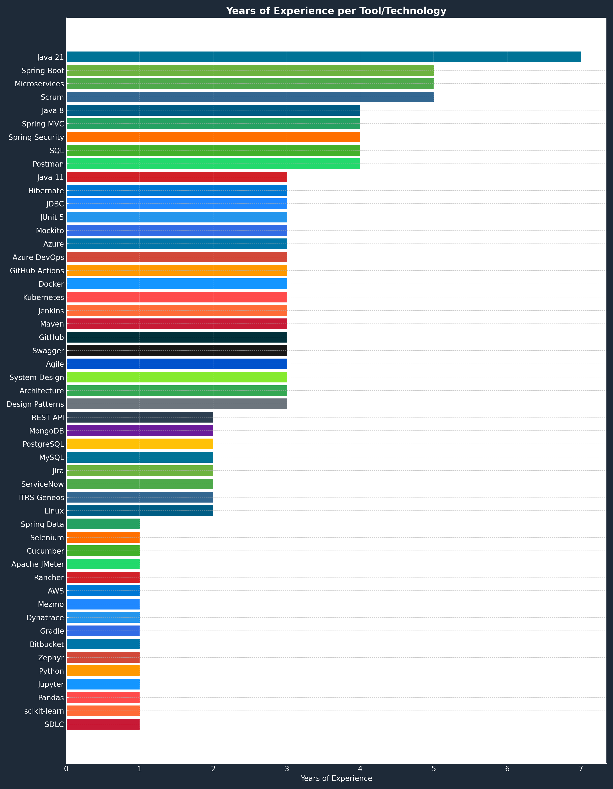

# Hi 👋, I'm Ignacio Naranjo 
### 👤 Pronouns: He/Him

### 💻 Java Backend Engineer | 7+ Years Experience | Cloud-Native Architectures | DevOps Enthusiast | Aspiring Data Scientist

I'm a passionate backend engineer specializing in Java and Spring Boot, with a strong focus on designing resilient microservices and cloud-native applications. I thrive in agile, multicultural teams and continuously expand my knowledge into data science, automation, and DevOps practices.

---

### 🚀 Currently working on:
- ⚒️ Improving backend services with **Java 21 + Spring Boot**
- 🌿 Expanding my **Full Stack** and **Cloud DevOps** skills
- 🤝 Collaborating in **international agile teams**
- 📊 Learning and exploring **Data Science** topics including Python, Jupyter, Pandas, scikit-learn, and data analysis techniques

---

### 📫 Connect with me 
[

📧 **Email:** `naranjoguerraji@hotmail.com`  

### 🏅 Certifications

### 📚  Skill & Toolset Overview

**Programming & Backend**  

**Testing**  

**DevOps & Cloud**  

**Monitoring & Logging**  

**Tools & Utilities**  

**Others**  

**Data Science (Learning)**  

**Methodologies & Architecture**  

---

### 🧪 Projects

**🟩 Market Price Estimator for Lemon Production (WIP)**  
Building a predictive model using Python, Pandas, and scikit-learn to estimate lemon prices based on historical trends and regional market data.

**🌿 Lemon Disease Detection with Computer Vision (Prototype)**  
Image classification model using a custom dataset captured with a Xiaomi 11T Pro. Tools: OpenCV, TensorFlow, and Jupyter.

**☁️ Backend Microservice Refactor**  
Led a migration project to upgrade legacy microservices to Java 21 and Spring Boot with containerized deployments using Docker and Kubernetes in Azure.

**📊 Data Cleaning and Visualization with Pandas**  
Exploratory Data Analysis (EDA) on agricultural datasets. Cleaned, transformed, and visualized key metrics using Pandas and Matplotlib.

